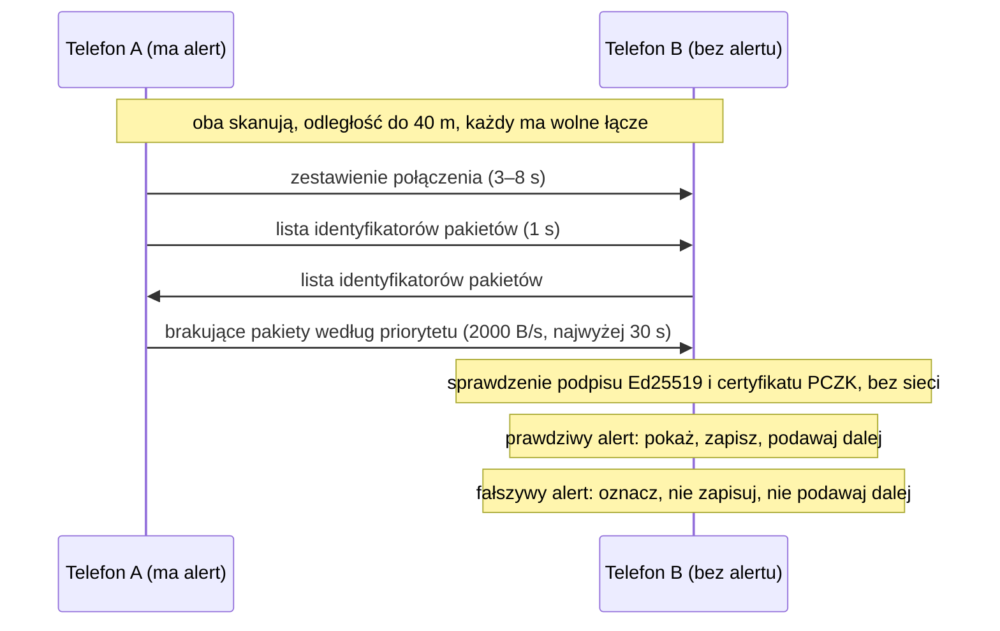
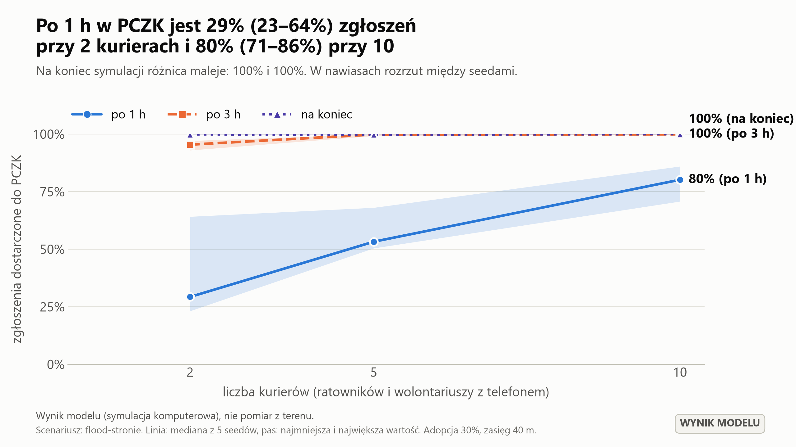
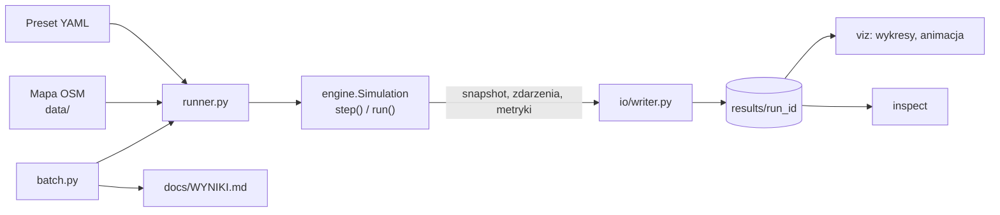

# Netless – offline'owy kanał kryzysowy telefon–telefon

Symulacja w Pythonie · HackYeah 2026 · kategoria SMART CITY

**Netless** to koncepcja modułu do aplikacji mObywatel, który w czasie kryzysu (powódź, blackout)
przekazuje informacje z telefonu do telefonu, gdy sieć komórkowa nie działa. To repozytorium nie
zawiera aplikacji mobilnej. Zawiera **silnik symulacji**, który pokazuje i mierzy, jak taki system
zachowałby się w prawdziwym mieście, oraz narzędzia do wykresów, animacji i przeglądu parametrów.

W kodzie i dokumentach projekt występuje pod nazwą roboczą **Sztafeta** (pakiet i polecenie `sztafeta`).

> **To jest model, nie pomiar.** Wszystkie liczby, wykresy i animacje pochodzą z symulacji komputerowej
> przy założeniach opisanych w [docs/MODEL.md](docs/MODEL.md). Scenariusz jest inspirowany powodzią
> w Stroniu Śląskim z września 2024 r., ale nie jest jej rekonstrukcją. Projekt nie jest oficjalnym
> produktem mObywatela i nie używa jego znaków.

## Spis treści

- [Co pokazuje symulacja](#co-pokazuje-symulacja)
- [Szybki start](#szybki-start)
- [Jak to działa](#jak-to-działa)
- [Scenariusz demo](#scenariusz-demo)
- [Polecenia](#polecenia)
- [Pliki wynikowe](#pliki-wynikowe)
- [Konfiguracja](#konfiguracja)
- [Wyniki modelu](#wyniki-modelu)
- [Struktura repozytorium](#struktura-repozytorium)
- [Silnik jako biblioteka](#silnik-jako-biblioteka)
- [Testy i jakość](#testy-i-jakość)
- [Ograniczenia modelu](#ograniczenia-modelu)
- [Dokumentacja](#dokumentacja)

## Co pokazuje symulacja

Dwa moduły działające na wspólnym silniku P2P:

| Moduł | Kierunek | Co sprawdzamy |
|---|---|---|
| **Sztafeta Komunikatów** | urząd → mieszkańcy | Alert podpisany przez PCZK rozchodzi się z telefonu na telefon. Każdy telefon weryfikuje podpis bez sieci, a fałszywy alert jest odrzucany. |
| **Kurier Danych do Sztabu** | mieszkańcy → urząd | Zgłoszenia „Jestem bezpieczny” i „Potrzebuję pomocy” zbierają telefony ratowników i oddają je w sztabie. Podpisane potwierdzenie „przyjęto” wraca do zgłaszającego. |

Symulacja odpowiada na pytania, których nie da się sprawdzić na kilku telefonach w sali: jak szybko
alert dociera do mieszkańców, ile zgłoszeń trafia do sztabu, od jakiego odsetka instalacji system
zaczyna działać i jak bardzo wynik zależy od zasięgu radia.

## Szybki start

Wymagania: Python 3.11 lub nowszy i [uv](https://docs.astral.sh/uv/).

```bash
uv sync                                                  # instalacja zależności
uv run sztafeta run --preset flood-stronie --seed 42     # symulacja -> results/flood-stronie_s42/
uv run sztafeta charts results/flood-stronie_s42         # wykresy i karta wyników (PNG 16:9)
uv run sztafeta animate results/flood-stronie_s42        # animacja mapy (MP4 1920x1080)
```

Mapa Stronia Śląskiego jest w repozytorium (`data/stronie-slaskie/`), więc wszystko działa bez sieci.
Scenariusz demo (ok. 5000 agentów, 6 godzin, krok 1 s) liczy się w mniej więcej 50 sekund.

## Jak to działa

### Świat symulacji

- **Mapa**: sieć ulic i budynki mieszkalne z OpenStreetMap (4729 węzłów, 99 km ulic, 1025 budynków).
  Ludzie poruszają się wyłącznie po grafie ulic.
- **Agenci**: mieszkańcy połączeni w gospodarstwa domowe, kurierzy (ratownicy i wolontariusze),
  hub (urząd z agregatem, siedziba PCZK) oraz troll rozsyłający fałszywy alert.
- **Adopcja**: tylko część mieszkańców ma aplikację (domyślnie 30%). Pozostali mogą dowiedzieć się
  o ewakuacji wyłącznie ustnie, od domowników i sąsiadów.
- **Czas**: krok 1 s, domyślnie 6 godzin od awarii sieci.

### Jeden krok symulacji

Każdą sekundę czasu modelu `Simulation.step()` wykonuje w tej samej kolejności:

1. zapisuje próbkę metryk (co 10 s),
2. uruchamia zaplanowane akcje scenariusza (awaria sieci, wydanie alertu, wyjazd kurierów),
3. przesuwa agentów po ulicach,
4. prowadzi kurierów po ich sektorach, do punktu ewakuacji i z powrotem do huba,
5. liczy zachowania ludzi: reakcję na alert, ewakuację, zgłoszenia, przekaz ustny,
6. wykrywa kontakty radiowe i przesyła pakiety między telefonami,
7. obsługuje to, co dotarło: nowe alerty u mieszkańców, zgłoszenia i potwierdzenia w PCZK,
8. usuwa z buforów pakiety, którym minął czas ważności (co 10 s).

### Jak łączą się dwa telefony



| Reguła | Wartość domyślna |
|---|---|
| Zasięg radia | 40 m (stały promień) |
| Skanowanie telefonu mieszkańca | 10 s na każde 60 s; początek okna losowany co cykl |
| Skanowanie kuriera i huba | ciągłe |
| Kiedy powstaje połączenie | oba urządzenia skanują, są w zasięgu, mają wolne łącze i przynajmniej jedno ma pakiet, którego drugie nie zna |
| Zestawienie połączenia | 3–8 s, potem 1 s na wymianę list identyfikatorów |
| Przepustowość | 2000 B/s na połączenie |
| Najdłuższa sesja | 30 s |
| Jednoczesne połączenia | 2 (mieszkaniec), 4 (kurier), 6 (hub) |
| Wyjście z zasięgu | przerywa transfer; niedosłane pakiety przepadają |

### Co jest przesyłane

| Pakiet | Kto podpisuje | Jak się rozchodzi | Priorytet |
|---|---|---|---|
| **Alert** – komunikat urzędowy jako kody (zagrożenie, działanie, obszar), wyświetlany w języku telefonu | PCZK | epidemicznie: każdy telefon podaje każdemu, do 100 skoków i 12 h | najwyższy |
| **Ack** – potwierdzenie przyjęcia do 32 zgłoszeń | PCZK | epidemicznie; po odebraniu telefon usuwa kopie potwierdzonych zgłoszeń | drugi |
| **Report** – zgłoszenie mieszkańca, wersjonowane | jednorazowy klucz urządzenia | Spray-and-Wait: 8 kopii, przy każdym kontakcie telefon oddaje połowę; kurier i hub przyjmują zawsze | „Potrzebuję pomocy” przed „Jestem bezpieczny” |

Gdy bufor telefonu się zapełni, najpierw wypadają pakiety przeterminowane, potem te o najniższym
priorytecie, potem najstarsze. Własnych niepotwierdzonych zgłoszeń telefon nie usuwa.

### Skąd telefon wie, że alert jest prawdziwy

Łańcuch zaufania ma trzy ogniwa: klucz główny przypięty w aplikacji podpisuje certyfikat wydawcy
(PCZK) z zakresem obszaru i okresem ważności, a wydawca podpisuje alerty i potwierdzenia. Telefon
sprawdza cały łańcuch lokalnie. Alert z błędnym podpisem, od nieznanego wydawcy, spoza obszaru,
przeterminowany albo starszy od już posiadanego nie jest uznawany za zweryfikowany i nigdy nie
uruchamia ewakuacji. Podpisy to Ed25519 z biblioteki `cryptography`.

### Ludzie

Mieszkaniec, który dostał zweryfikowany alert „ewakuuj”, po czasie reakcji (mediana 5 minut) idzie do
punktu ewakuacji, zostaje w domu albo zgłasza potrzebę pomocy. Osoba z aplikacją informuje domowników
od razu, a sąsiadów w promieniu 10 m z prawdopodobieństwem 20% na minutę. Zasięg ustny jest liczony
w osobnych kolumnach i nigdy nie jest doliczany do zasięgu aplikacji.

## Scenariusz demo

Preset `flood-stronie`: powódź w Stroniu Śląskim, awaria sieci komórkowej, ewakuacja całego miasta.

| Chwila | Wydarzenie |
|---|---|
| T+0 | awaria sieci komórkowej |
| T+10 min | PCZK wydaje podpisany alert „powódź – ewakuacja” |
| T+20 min | pięciu kurierów rozchodzi się po mieście; co ok. 30 minut wracają do huba |
| T+30 min | troll rozsyła fałszywy alert |
| T+3 h | nowa wersja alertu zastępuje poprzednią |

Założenia tego scenariusza, inne niż domyślne w modelu:

- alert dotyczy całego miasta, bez wydzielonej strefy zagrożenia (`scenario.area: city`),
- 4956 mieszkańców, czyli pełna liczba według GUS (`population.n_residents`),
- zwarta zabudowa: ludzie mieszkają w 25% budynków o najgęstszym otoczeniu (`population.settled_share`),
- 92% poinformowanych rusza do punktu ewakuacji (`behavior.p_comply`).

Zasady radia, routingu i przekazu ustnego są takie same jak w pozostałych presetach. Gęsta zabudowa
i wysokie posłuszeństwo wobec alertu są dobrane tak, żeby pokazać miasto, w którym system działa
dobrze; ile od nich zależy, pokazuje sekcja [Wyniki modelu](#wyniki-modelu).

Animacja opowiada jedną historię: pada sieć, PCZK wydaje alert, kurierzy rozchodzą się po mieście,
zbliżenie pokazuje trzy przekazania alertu z telefonu na telefon, mieszkańcy idą do punktu ewakuacji.
Osób bez aplikacji, zgłoszeń do PCZK i fałszywego alertu na niej nie ma; są w liczbach i na wykresach.

## Polecenia

| Polecenie | Co robi |
|---|---|
| `uv run sztafeta run --preset flood-stronie --seed 42` | jedno uruchomienie, wynik w `results/<run_id>/` |
| `uv run sztafeta run --preset flood-stronie --seed 42 --baseline` | wariant bazowy: telefony niczego sobie nie przekazują |
| `uv run sztafeta charts results/<run_id>` | trzy wykresy i karta wyników; wariant bazowy jest dołączany, jeśli istnieje |
| `uv run sztafeta animate results/<run_id>` | animacja mapy (MP4, a bez ffmpeg GIF) |
| `uv run sztafeta frame results/<run_id> --t 5400` | jedna klatka animacji jako PNG; `--closeup` daje kadr zbliżenia |
| `uv run sztafeta inspect results/<run_id> --agent 120 --t 3600` | stan telefonu wybranego agenta w danej chwili (JSON) |
| `uv run sztafeta batch` | przegląd parametrów: adopcja × zasięg × kurierzy × seedy; generuje `docs/WYNIKI.md` |
| `uv run sztafeta fetch-osm --preset flood-stronie` | ponowne pobranie mapy z OpenStreetMap (wymaga sieci) |

Każde polecenie ma opcję `--help`. Napisy na wykresach i w animacji są po polsku; `--lang en` daje
wersję angielską.

## Pliki wynikowe

Katalog `results/<run_id>/` po `sztafeta run`:

| Plik | Zawartość |
|---|---|
| `params.yaml` | pełne parametry, seed, wersja kodu, oś czasu scenariusza |
| `summary.json` | najważniejsze liczby uruchomienia |
| `metrics.csv` | metryki co 10 s czasu modelu |
| `events.jsonl` | zdarzenia: kontakt, transfer, odbiór i odrzucenie alertu, ewakuacja, zgłoszenie, potwierdzenie |
| `snapshots.npz` | pozycje i stany agentów co 10 s |
| `static.json` | mapa i stałe cechy agentów |
| `pczk.json` | dashboard sztabu na koniec: liczniki i zgłoszenia według pilności |
| `wykresy/*.png`, `animacja_*.mp4` | po `charts` i `animate` |

Identyfikator uruchomienia wynika z ustawień (`flood-stronie_s42`, `flood-stronie_s42_baseline`),
więc te same ustawienia trafiają zawsze do tego samego katalogu. Dokładne schematy plików opisuje
[docs/FORMAT.md](docs/FORMAT.md).

## Konfiguracja

Scenariusze to pliki YAML w `src/sztafeta/scenarios/presets/`:

| Preset | Do czego służy |
|---|---|
| `flood-stronie` | scenariusz demo na mapie Stronia Śląskiego |
| `flood-grid` | ta sama oś czasu na proceduralnej siatce ulic, bez danych OSM i z domyślną gęstością zaludnienia |
| `test-small` | mały, szybki scenariusz dla testów automatycznych |

Pojedyncze parametry nadpisuje się opcją `--set sekcja.pole=wartość`:

```bash
uv run sztafeta run --set behavior.adoption=0.5 --set radio.range_m=80 --set population.n_couriers=8
```

Najważniejsze parametry:

| Parametr | Domyślnie | W scenariuszu demo |
|---|---|---|
| `behavior.adoption` – odsetek mieszkańców z aplikacją | 30% | 30% |
| `radio.range_m` – zasięg radia | 40 m | 40 m |
| `radio.scan_window_s` / `scan_period_s` – skanowanie | 10 s / 60 s | 10 s / 60 s |
| `population.n_couriers` – liczba kurierów | 5 | 5 |
| `population.n_residents` – liczba mieszkańców | 3000 | 4956 |
| `population.settled_share` – część zamieszkanych budynków | 1,0 | 0,25 |
| `behavior.p_comply` – posłuszeństwo wobec alertu | 85% | 92% |

Komplet parametrów z uzasadnieniem i źródłem każdej wartości: [docs/MODEL.md](docs/MODEL.md).

## Wyniki modelu

Mediana z 5 seedów dla scenariusza demo przy adopcji 30%, zasięgu 40 m i 5 kurierach; w nawiasach
najmniejsza i największa wartość. Pełne tabele: [docs/WYNIKI.md](docs/WYNIKI.md).

| Miara | Wynik |
|---|---|
| Telefony z aplikacją, które po 6 h mają zweryfikowany alert | 99,7% (99,7–100) |
| Czas, po którym alert ma połowa telefonów z aplikacją | 18 min (17–19) |
| Zgłoszenia mieszkańców dostarczone do PCZK | 99,8%, mediana opóźnienia 16 min |
| Zgłaszający, do których wróciło potwierdzenie | 99,6% dostarczonych zgłoszeń |
| Mieszkańcy, którzy dotarli do punktu ewakuacji | 84%, w tym 26% z aplikacją i 58% poinformowanych ustnie |
| Urządzenia, które uznały fałszywy alert za prawdziwy | 0 w 225 uruchomieniach |

Co daje który mechanizm:

| Wariant | Alert na telefonach z aplikacją | Zgłoszenia w PCZK |
|---|---|---|
| Bez przekazywania (tylko zasięg huba) | 4,2% | 1,9% |
| Same telefony, bez kurierów | 98,8% | 4,6% |
| Sami kurierzy, bez przekazywania telefon–telefon | 95,7% | 70,2% |
| Telefony i kurierzy | 99,7% | 99,8% |

Jak bardzo wynik zależy od założeń:

| Zmiana względem scenariusza demo | Alert na telefonach | W punkcie ewakuacji |
|---|---|---|
| bez zmian | 99,7% | 84% |
| zasięg radia 25 m | 98,4% | – |
| zabudowa rozproszona (mieszkańcy we wszystkich budynkach) | 89,5% | 70% |
| posłuszeństwo wobec alertu 85% | 99,7% | 78% |
| przekaz ustny tylko między domownikami | 99,8% | 54% |
| bez przekazu ustnego | 99,8% | 26% |

Dwa wnioski, których nie należy pomijać przy prezentacji: aplikacja sama obejmuje tylko swoich
użytkowników, a większość ewakuowanych to osoby bez aplikacji poinformowane ustnie; siła tego
przekazu jest założeniem modelu.



## Struktura repozytorium



```
src/sztafeta/
  engine/        rdzeń: tylko numpy, scipy i cryptography; bez plików, wykresów i print
    model.py       typy: pakiety (Alert, Report, Ack), parametry, scenariusz, tablice agentów
    rng.py         jedyne źródło losowości: niezależne strumienie z jednego seeda
    graph.py       graf ulic jako tablice, najkrótsze ścieżki
    geo.py         geohash, punkt w wielokącie, przeliczenie metrów na stopnie
    population.py  budowa populacji: gospodarstwa domowe, adopcja, języki, zwarta zabudowa
    mobility.py    ruch po trasach (wektorowo), patrole kurierów
    behavior.py    spacery, reakcja na alert, ewakuacja, zgłoszenia, przekaz ustny
    contacts.py    wykrywanie kontaktów, okna skanowania, zestawianie połączeń, transfer, bateria
    routing.py     bufory, routing epidemiczny i Spray-and-Wait, priorytety
    crypto.py      Ed25519, łańcuch zaufania, weryfikacja
    pczk.py        sztab: deduplikacja zgłoszeń, potwierdzenia zbiorcze, dashboard
    templates.py   kody alertu -> tekst w języku telefonu (PL, EN, UK, DE, CS)
    metrics.py     metryki w czasie i podsumowanie
    events.py      strumień zdarzeń
    sim.py         klasa Simulation: step(), run(), snapshot(), akcje scenariusza
  scenarios/     presety YAML i ich ładowanie
  data/          import z OpenStreetMap, siatka proceduralna, zapis map
  io/            zapis i odczyt wyników uruchomienia
  viz/           animacja mapy, wykresy, karta wyników (matplotlib)
  runner.py      jedno uruchomienie z presetu
  batch.py       przegląd parametrów (multiprocessing)
  wyniki.py      generator docs/WYNIKI.md
  cli.py         polecenia wiersza poleceń
tests/           testy pytest
data/            mapa Stronia Śląskiego (w repozytorium, żeby symulacja działała offline)
docs/            koncepcja, założenia modelu, formaty, wyniki, źródła
results/         wyniki uruchomień (poza repozytorium)
```

Trzy zasady, których trzyma się kod:

- **Determinizm.** Cała losowość przechodzi przez `engine/rng.py`. Ten sam seed i te same parametry
  dają identyczne pliki wyników, co sprawdza test.
- **Silnik bez warstwy prezentacji.** `engine/` nie importuje `viz/`, `io/` ani `cli.py`. Na zewnątrz
  wychodzą tylko `snapshot()`, `describe()` i strumień zdarzeń.
- **Wydajność.** Stan agentów i buforów to tablice numpy, kontakty szuka `cKDTree`, a pętle Pythona
  obejmują tylko faktyczne kontakty.

## Silnik jako biblioteka

Silnik jest zwykłą klasą Pythona bez wejścia i wyjścia, więc da się go opakować w API (na przykład
FastAPI) cienką warstwą:

```python
from sztafeta.engine import Simulation
from sztafeta.scenarios import load_preset

params, scenario = load_preset("flood-stronie", overrides=["behavior.adoption=0.5"])
sim = Simulation(params, scenario, seed=42)

static = sim.describe()  # mapa i agenci, wysyłane raz
sim.run(until=3600)  # albo sim.step() w pętli serwera
frame = sim.snapshot()  # stan w bieżącej chwili, serializowalny do JSON
events = sim.drain_events()  # zdarzenia od poprzedniego wywołania
phone = sim.phone_view(120)  # ekran telefonu wybranego agenta
board = sim.pczk_dashboard()  # dashboard sztabu
```

Akcje scenariusza to metody tej samej klasy: `network_down`, `issue_alert`, `cancel_alert`,
`dispatch_couriers`, `troll_broadcast`, `submit_report`. Gotowe uruchomienie można też odtworzyć we
frontendzie bez silnika; wystarczą `static.json`, `snapshots.npz` i `events.jsonl`. Tabela metod
z proponowanymi endpointami i wszystkie schematy są w [docs/FORMAT.md](docs/FORMAT.md).

## Testy i jakość

```bash
uv run ruff check . && uv run ruff format --check .   # lint i formatowanie
uv run mypy src                                       # typy (tryb strict)
uv run pytest                                         # 120 testów
```

Testy obejmują między innymi: powtarzalność wyników, weryfikację podpisów i łańcucha zaufania,
odrzucanie fałszywych alertów, reguły kontaktu radiowego, routing i bufory, dostarczanie zgłoszeń
i potwierdzeń, pliki wynikowe oraz rysowanie wykresów i animacji.

## Ograniczenia modelu

- Zasięg radia to stały promień. Model nie liczy tłumienia przez ściany, zakłóceń, różnic między
  telefonami ani ograniczeń aplikacji działającej w tle.
- Okno skanowania i zasięg radia wpływają na wynik najmocniej, a żadnego z nich nie zmierzyliśmy
  w terenie.
- Urządzenia łączą się tylko wtedy, gdy mają sobie coś do przekazania. Jałowych połączeń i ich kosztu
  baterii model nie liczy, co działa na korzyść systemu.
- Zachowania ludzi (czas reakcji, posłuszeństwo wobec alertu, przekaz ustny) to założenia zespołu,
  nie dane z badań.
- Scenariusz demo zakłada gęsto zaludnione miasto i ewakuację do jednego punktu, którego pojemności
  model nie liczy. Nie ma mapy zalewowej ani zalanych ulic.
- Kurierzy przekazują alert tylko przez aplikację; nikogo nie informują ustnie.
- Wariant bazowy nie obejmuje syren, megafonów ani obchodu służb. Jest dolną granicą, a nie opisem
  tego, co się wydarzyło.
- Atakujący to tylko troll z fałszywym alertem. Model nie symuluje zagłuszania ani ataków Sybil.
- Tłumaczenia alertów na ukraiński, niemiecki i czeski są robocze.

## Dokumentacja

| Dokument | Zawartość |
|---|---|
| [docs/KONCEPT.md](docs/KONCEPT.md) | koncepcja produktu: problem, oba moduły, bezpieczeństwo, scenariusz demo dla jury |
| [docs/MODEL.md](docs/MODEL.md) | założenia symulacji: każdy parametr z wartością, uzasadnieniem i źródłem |
| [docs/WYNIKI.md](docs/WYNIKI.md) | wyniki przeglądu parametrów; plik generowany poleceniem `sztafeta batch` |
| [docs/FORMAT.md](docs/FORMAT.md) | formaty wyjściowe i API silnika; kontrakt dla backendu i frontendu |
| [docs/ZRODLA.md](docs/ZRODLA.md) | biblioteki z licencjami, dane (OpenStreetMap, ODbL), literatura, użycie AI |

Dane mapowe: © autorzy OpenStreetMap, licencja ODbL. Informacja o bibliotekach i o użyciu AI, wymagana
regulaminem HackYeah, jest w [docs/ZRODLA.md](docs/ZRODLA.md).
