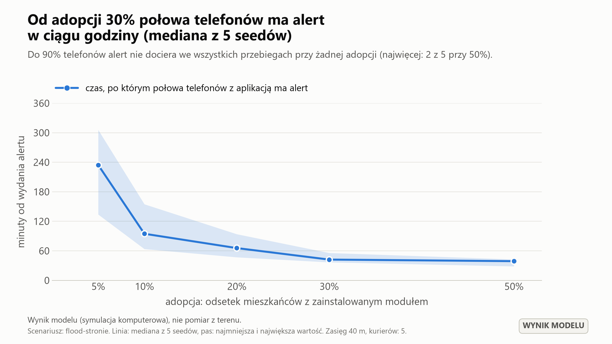
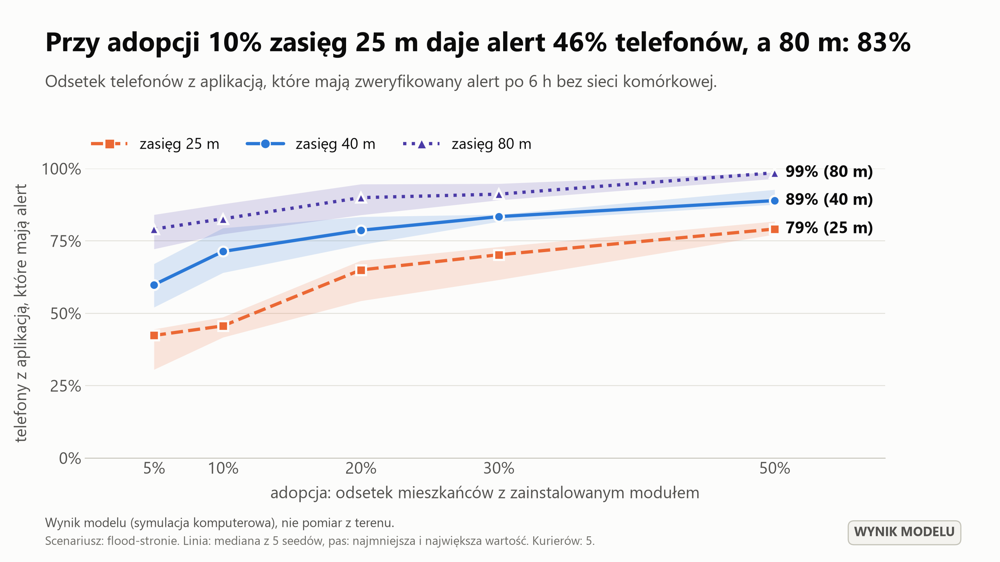

# Wyniki symulacji „Sztafeta” – przegląd parametrów

**To są wyniki modelu, nie pomiary z terenu.** Pokazują, jak system zachowuje się w symulacji przy założeniach opisanych w [MODEL.md](MODEL.md). Dokument jest generowany poleceniem `sztafeta batch` i nie jest poprawiany ręcznie; liczby nie są zaokrąglane na korzyść projektu.

## Co zostało policzone

- preset: `flood-stronie`, mapa: OpenStreetMap, Stronie Śląskie (© autorzy OpenStreetMap (ODbL))
- czas symulacji: 6 h od awarii sieci, 2999 mieszkańców
- adopcja: 5%, 10%, 20%, 30%, 50%
- zasięg radia: 25 m, 40 m, 80 m
- liczba kurierów: 2, 5, 10
- seedy: 5 na kombinację (1–5); łącznie 265 uruchomień
- przy ustawieniach odniesienia (adopcja 30%, zasięg 40 m, 5 kurierów) dodatkowo: wariant bez Sztafety, same telefony, sami kurierzy i warianty wrażliwości (punkty 5 i 6)
- wersja kodu: `0.1.0+839b5dc`

W tabelach podajemy **medianę między seedami**, a w nawiasie **najmniejszą i największą wartość** (rozrzut). Czasy liczymy od wydania alertu. „Adopcja” oznacza telefony z zainstalowanym i działającym modułem (Bluetooth włączony, aplikacja może pracować w tle).

## Liczby na slajd

1. W modelu (adopcja 30%, zasięg 40 m, 5 kurierów, 5 seedów) zweryfikowany alert po 6 h ma **83% telefonów z aplikacją** (rozrzut 82–84%), a w strefie zagrożenia **96%**. Połowa telefonów ma go po 42 min (37–56) od wydania. Przy zasięgu 25 m: 70% telefonów, połowa po 125 min (99–192).
2. Skąd bierze się ten wynik (adopcja 30%, zasięg 40 m, 5 kurierów, 5 seedów): bez żadnego przekazywania alert ma 2.7% telefonów; same telefony bez kurierów dają 70% (w strefie 58%); sami kurierzy bez przekazywania telefon–telefon 44% (w strefie 80%); oba mechanizmy razem **83%** (w strefie 96%). W strefie zagrożenia większość pracy wykonują kurierzy, poza nią telefony mieszkańców.
3. W modelu (adopcja 30%, zasięg 40 m, 5 kurierów, 5 seedów) do PCZK dociera **99% zgłoszeń mieszkańców strefy zagrożenia** i 51% zgłoszeń spoza strefy, gdzie kurierzy nie patrolują (łącznie 76%). Mediana opóźnienia dostarczonych zgłoszeń to 12 min. Potwierdzenie „przyjęto” wraca do **96%** zgłaszających, których zgłoszenie dotarło.
4. W modelu (adopcja 30%, zasięg 40 m, 5 kurierów, 5 seedów) ze strefy zagrożenia ewakuuje się **67%** mieszkańców: 24% to osoby z aplikacją, a 43% osoby bez aplikacji poinformowane ustnie przez domowników i sąsiadów. To założenie modelu: bez przekazu ustnego ewakuuje się 22%, a gdy informują się tylko domownicy – 45%.
5. We wszystkich 225 uruchomieniach pełnej siatki fałszywy alert uznało za zweryfikowany **0 urządzeń** (dostało go: mediana 55 urządzeń w bezpośrednim zasięgu trolla).

## Od jakiej adopcji system ma sens

Kryterium (umowne, przy 5 kurierach): połowa telefonów z aplikacją ma alert **najpóźniej godzinę po jego wydaniu**, a po 6 h ma go **co najmniej 90% telefonów z aplikacją w strefie zagrożenia** (mediany między seedami). Sam zasięg na koniec nie wystarcza: przy małej adopcji alert roznoszą głównie kurierzy i trwa to godzinami.

| Zasięg radia | Najmniejsza badana adopcja spełniająca kryterium |
|---|---|
| 25 m | nie osiągnięto (do 50%) |
| 40 m | 30% |
| 80 m | 5% |

**Próg w modelu przy zasięgu 40 m i 5 kurierach: adopcja 30%.** To najmniejsza z badanych wartości, a nie dokładna granica.
Przy adopcji 20% połowa telefonów ma alert dopiero po 66 min (47–94), a zasięg w strefie zagrożenia wynosi 95%.

Uwagi: (1) próg zależy od zasięgu radia bardziej niż od czegokolwiek innego, a zasięgu w zabudowie nie znamy; (2) próg dotyczy sytuacji z kurierami w terenie; (3) nawet powyżej progu sama aplikacja obejmuje tylko swoich użytkowników, czyli przy adopcji 30% najwyżej 30% mieszkańców; reszta zależy od przekazu ustnego i innych kanałów.

## 1. Czas do zasięgu 50% i 90% telefonów z aplikacją (5 kurierów)

| Adopcja | Zasięg | Czas do 50% | Czas do 90% | Zasięg po 6 h | W strefie zagrożenia |
|---|---|---|---|---|---|
| 5% | 25 m | nie osiągnięto | nie osiągnięto | 42.4% (30.6–44.5) | 65.7% (56.7–73.0) |
| 5% | 40 m | 234 min (134–306) | nie osiągnięto | 59.9% (52.1–67.1) | 88.6% (76.7–92.1) |
| 5% | 80 m | 49 min (25–56) | nie osiągnięto | 79.1% (72.2–84.1) | 100.0% (91.9–100.0) |
| 10% | 25 m | nie osiągnięto | nie osiągnięto | 45.7% (41.7–48.7) | 72.6% (67.0–75.4) |
| 10% | 40 m | 95 min (64–155) | nie osiągnięto | 71.4% (64.0–79.5) | 94.0% (86.2–96.7) |
| 10% | 80 m | 35 min (18–54) | nie osiągnięto | 82.7% (77.4–87.7) | 98.5% (93.8–100.0) |
| 20% | 25 m | 219 min (170–279) | nie osiągnięto | 65.0% (54.3–68.2) | 81.9% (76.5–84.0) |
| 20% | 40 m | 66 min (47–94) | nie osiągnięto | 78.7% (73.7–83.4) | 95.2% (92.5–96.8) |
| 20% | 80 m | 29 min (15–33) | 312 min (283–340), tylko 2/5 przebiegów | 90.0% (84.0–94.6) | 98.8% (97.8–100.0) |
| 30% | 25 m | 125 min (99–192) | nie osiągnięto | 70.2% (61.6–73.0) | 84.0% (79.4–87.1) |
| 30% | 40 m | 42 min (37–56) | nie osiągnięto | 83.4% (81.7–84.1) | 96.1% (91.5–96.3) |
| 30% | 80 m | 17 min (14–25) | 304 min (179–333), tylko 4/5 przebiegów | 91.2% (89.1–94.8) | 99.2% (97.5–100.0) |
| 50% | 25 m | 99 min (70–109) | nie osiągnięto | 79.1% (77.3–81.8) | 88.9% (84.5–92.0) |
| 50% | 40 m | 39 min (29–43) | 265 min (200–331), tylko 2/5 przebiegów | 88.9% (87.6–92.7) | 97.1% (94.7–99.0) |
| 50% | 80 m | 15 min (12–20) | 152 min (120–251) | 98.6% (96.5–98.7) | 99.4% (98.9–100.0) |

## 2. Zgłoszenia dostarczone do PCZK (zasięg 40 m)

Odsetek zgłoszeń wysłanych do danej chwili, które do tej chwili dotarły do PCZK (czas od awarii sieci). Kurierzy patrolują strefę zagrożenia i punkt ewakuacji, dlatego zgłoszenia ze strefy i spoza niej pokazujemy osobno. Liczba zgłoszeń rośnie z zasięgiem alertu, więc odsetki łączne z różnych wierszy nie są wprost porównywalne.

| Adopcja | Kurierzy | Zgłoszeń (mediana) | Po 1 h | Po 3 h | Po 6 h | Ze strefy | Spoza strefy | „Potrzebuję pomocy” | Mediana opóźnienia dostarczonych |
|---|---|---|---|---|---|---|---|---|---|
| 5% | 2 | 31 | 33.3% (0.0–90.0) | 70.8% (65.4–84.0) | 86.2% (64.1–90.0) | 94.1% (83.3–100.0) | 70.0% (47.6–80.0) | 60.0% (25.0–100.0) | 17 min |
| 5% | 5 | 37 | 50.0% (31.6–68.8) | 84.6% (78.3–96.9) | 86.5% (78.8–90.5) | 100.0% (95.5–100.0) | 61.1% (50.0–85.0) | 80.0% (50.0–100.0) | 12 min |
| 5% | 10 | 35 | 74.1% (46.2–86.4) | 88.9% (69.7–97.2) | 90.9% (77.1–94.6) | 100.0% (100.0–100.0) | 77.8% (55.6–83.3) | 66.7% (0.0–100.0) | 10 min |
| 10% | 2 | 74 | 52.2% (0.0–60.0) | 68.6% (46.8–76.8) | 78.4% (68.1–91.9) | 100.0% (97.6–100.0) | 51.4% (35.3–74.1) | 71.4% (40.0–88.9) | 18 min |
| 10% | 5 | 87 | 63.0% (55.6–73.7) | 74.5% (68.4–94.9) | 76.7% (68.4–92.6) | 100.0% (100.0–100.0) | 52.8% (35.1–78.1) | 80.0% (50.0–85.7) | 11 min |
| 10% | 10 | 82 | 71.4% (54.1–73.2) | 78.3% (73.0–85.7) | 77.2% (74.7–88.8) | 100.0% (97.8–100.0) | 51.2% (43.9–74.3) | 75.0% (0.0–83.3) | 11 min |
| 20% | 2 | 184 | 50.7% (0.0–58.5) | 66.2% (53.9–77.7) | 74.6% (72.1–79.9) | 98.2% (97.5–99.0) | 50.5% (45.2–55.2) | 60.0% (53.3–85.7) | 20 min |
| 20% | 5 | 188 | 58.2% (51.2–66.3) | 80.5% (75.5–92.3) | 80.8% (74.0–84.8) | 99.1% (97.7–100.0) | 59.0% (48.8–69.6) | 78.6% (61.5–90.5) | 13 min |
| 20% | 10 | 191 | 69.6% (63.7–72.0) | 78.3% (74.1–82.9) | 81.1% (76.8–83.1) | 99.1% (97.8–100.0) | 61.1% (53.1–67.3) | 73.3% (63.2–100.0) | 12 min |
| 30% | 2 | 295 | 45.5% (0.0–58.9) | 69.6% (63.8–71.2) | 72.7% (68.2–76.6) | 98.4% (96.1–99.4) | 48.3% (38.9–51.8) | 80.0% (61.5–90.9) | 21 min |
| 30% | 5 | 305 | 54.7% (39.8–66.7) | 73.4% (67.9–78.1) | 75.5% (72.1–80.0) | 99.4% (98.8–100.0) | 51.2% (48.3–59.0) | 85.0% (66.7–90.5) | 12 min |
| 30% | 10 | 298 | 71.4% (70.4–75.2) | 78.4% (72.9–79.3) | 78.5% (74.1–82.7) | 100.0% (99.3–100.0) | 54.4% (45.6–62.1) | 85.7% (82.4–93.3) | 12 min |
| 50% | 2 | 479 | 48.6% (0.8–53.1) | 67.7% (60.9–73.9) | 71.6% (67.0–78.9) | 99.2% (97.4–99.6) | 42.9% (39.4–56.0) | 78.8% (69.2–84.6) | 20 min |
| 50% | 5 | 514 | 56.1% (42.9–59.7) | 73.7% (70.8–74.6) | 77.4% (74.3–77.9) | 100.0% (98.4–100.0) | 53.8% (48.7–56.3) | 82.5% (75.0–90.3) | 15 min |
| 50% | 10 | 539 | 62.3% (54.6–67.0) | 73.7% (70.5–76.4) | 75.1% (69.4–76.7) | 99.6% (99.2–100.0) | 51.0% (43.3–51.8) | 82.9% (72.5–91.4) | 13 min |

## 3. Potwierdzenia (Ack), które wróciły do zgłaszających (zasięg 40 m)

Odsetek zgłoszeń dostarczonych do PCZK, których autor dostał podpisane potwierdzenie „przyjęto”.

| Adopcja | 2 kurierów | 5 kurierów | 10 kurierów |
|---|---|---|---|
| 5% | 92.3% (80.0–96.3) | 92.9% (84.6–100.0) | 93.3% (88.9–100.0) |
| 10% | 92.8% (86.1–100.0) | 95.2% (90.4–97.1) | 95.2% (91.8–97.7) |
| 20% | 94.9% (93.7–97.3) | 96.4% (95.2–98.1) | 96.5% (95.6–98.0) |
| 30% | 96.0% (95.6–97.7) | 96.2% (95.7–96.3) | 96.8% (95.9–98.6) |
| 50% | 96.3% (94.8–98.1) | 97.1% (95.4–97.4) | 97.7% (96.4–98.8) |

## 4. Fałszywe alerty

- urządzenia, które uznały fałszywy alert za zweryfikowany: **0** (maksimum ze wszystkich 225 uruchomień pełnej siatki; oczekiwane 0)
- urządzenia, które go odebrały i oznaczyły jako niezweryfikowany: mediana 55, najwięcej 314
- żadne urządzenie nie rozpoczęło ewakuacji ani nie zmieniło stanu z powodu fałszywego alertu (test automatyczny)

## 5. Co daje który mechanizm (adopcja 30%, zasięg 40 m, 5 kurierów, 5 seedów)

| Wariant | Zasięg alertu (telefony z aplikacją) | Zasięg w strefie zagrożenia | Czas do 50% | Ewakuowani ze strefy | Zgłoszenia w PCZK |
|---|---|---|---|---|---|
| Bez Sztafety: tylko zasięg huba, zgłoszenia osobiście | 2.7% (1.9–2.9) | 0.0% (0.0–0.0) | nie osiągnięto | 0.0% (0.0–0.0) | 9.5% (0.0–33.3) |
| Same telefony, bez kurierów | 70.2% (59.7–72.8) | 57.7% (40.0–69.7) | 162 min (81–283) | 40.7% (28.2–48.0) | 12.7% (10.7–15.0) |
| Sami kurierzy, bez przekazywania telefon–telefon | 44.2% (40.3–46.2) | 80.3% (78.0–92.9) | nie osiągnięto | 56.9% (55.3–58.6) | 91.8% (88.0–94.9) |
| Pełna Sztafeta: telefony i kurierzy | 83.4% (81.7–84.1) | 96.1% (91.5–96.3) | 42 min (37–56) | 66.6% (56.0–68.0) | 75.5% (72.1–80.0) |

- **Bez Sztafety**: telefony nie przekazują pakietów, alert dostaje tylko urządzenie w zasięgu huba, zgłoszenie trzeba zanieść osobiście. Wariant nie obejmuje syren, megafonów ani obchodu służb – to dolna granica, nie opis tego, co się wydarzyło.
- **Same telefony**: sieć niesiona ruchem ludzi. Bez kurierów alert rozchodzi się po mieście, ale wolno, a zgłoszenia prawie nie docierają do PCZK.
- **Sami kurierzy**: kurier przekazuje alert telefonom, które mija, i zbiera od nich zgłoszenia, ale telefony nie podają niczego dalej. Wysoki odsetek zgłoszeń wynika też z tego, że poza strefą alert ma mniej osób, więc mniej osób w ogóle wysyła zgłoszenie.

## 6. Wrażliwość na założenia (adopcja 30%, zasięg 40 m, 5 kurierów, 5 seedów)

Po jednej zmianie względem ustawień odniesienia. Tych założeń nie da się dziś sprawdzić w terenie, a wpływają na wynik podobnie mocno jak zasięg radia.

| Wariant | Zasięg alertu (telefony z aplikacją) | Zasięg w strefie zagrożenia | Czas do 50% | Ewakuowani ze strefy | Zgłoszenia w PCZK |
|---|---|---|---|---|---|
| Ustawienia odniesienia | 83.4% (81.7–84.1) | 96.1% (91.5–96.3) | 42 min (37–56) | 66.6% (56.0–68.0) | 75.5% (72.1–80.0) |
| Bez przekazu ustnego | 84.1% (81.1–88.7) | 94.8% (92.4–99.2) | 47 min (32–59) | 22.1% (20.8–23.0) | 77.2% (74.6–79.3) |
| Przekaz ustny tylko między domownikami | 87.5% (81.6–89.1) | 96.2% (92.9–97.0) | 44 min (38–56) | 45.0% (43.0–47.3) | 75.9% (72.1–79.4) |
| Okno skanowania 5 s co 60 s (zamiast 10 s) | 79.9% (78.4–81.0) | 94.8% (90.0–97.2) | 53 min (45–67) | 62.0% (53.9–67.2) | 78.9% (70.1–80.3) |
| Okno skanowania 5 s co 120 s | 69.4% (58.1–74.2) | 87.0% (84.1–95.2) | 116 min (74–189) | 60.6% (52.9–62.9) | 77.4% (72.1–82.5) |
| Zestawianie połączenia 8–15 s (zamiast 3–8 s) | 82.6% (79.7–86.0) | 95.3% (89.1–97.2) | 49 min (41–52) | 65.1% (61.5–70.3) | 76.3% (69.6–79.1) |

## Koszt i mechanizmy, które w tym scenariuszu nie zadziałały

- średnia bateria telefonów z aplikacją po 6 h: mediana 51% (start: 35–100%). To prosta konsekwencja założonego zużycia, a nie wynik symulacji; rozładowane telefony: najwięcej 0 w jednym uruchomieniu
- łączny transfer w mieście: mediana 2.9 MB na uruchomienie; 76% transferów to potwierdzenia (każdy Ack rozchodzi się po całym mieście, choć dotyczy najwyżej 32 zgłaszających) – to miejsce do optymalizacji
- pakiety usunięte z przepełnionych buforów: najwięcej 0 w jednym uruchomieniu. Limit bufora, limit skoków i czasy życia pakietów są dłuższe niż potrzeby scenariusza 6-godzinnego, więc przegląd ich nie testuje (robią to testy jednostkowe)
- czas obliczeń jednego uruchomienia: mediana 11 s

Pliki źródłowe: `results/batch/runs.csv` (każde uruchomienie) i `results/batch/summary.csv` (agregacja).
